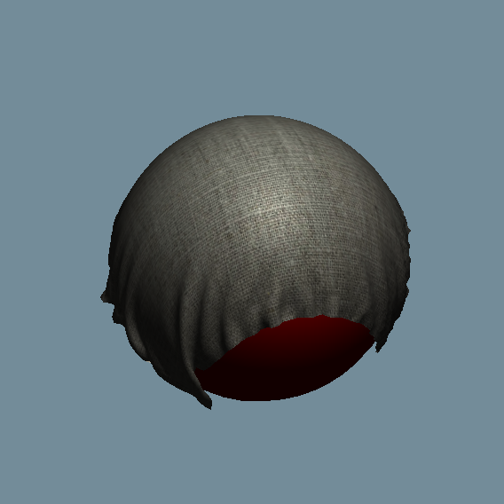

# Fabric Simulation

## Overview
This project implements a physically-based knit fabric simulation using OpenGL. The simulation features material based cloth dynamics, collision detection, procedural fur generation and texture mapping, and advanced rendering capabilities.

<p align="center">
  
  
  
</p>

## Core Components

### 1. Application Class
Location: `Application.h/cpp`
- Main application controller
- Handles initialization of OpenGL, GLFW, and ImGui
- Manages the main rendering loop
- Controls camera movement and user input
- Coordinates cloth simulation and rendering

### 2. Particle System
Location: `Particle.h`
- Implements individual particles that make up the cloth
- Features:
  - Position and velocity tracking
  - Force application
  - Collision response
  - Rendering capabilities

### 3. Spring System
Location: `Spring.h`
- Connects particles to create cloth structure
- Properties:
  - Spring constant (k)
  - Rest length
  - Force calculation using Hooke's Law

### 4. Collision Detection
Multiple implementations:
- `CollisionDetection.h/cpp`: Main collision detection system
- `NewCollision.h/cpp`: Enhanced collision detection with BVH support
- Features:
  - AABB collision detection
  - Triangle-triangle intersection tests
  - Sphere collision detection

### 5. Bounding Volume Hierarchy (BVH)
Location: `BVH.h/cpp`, `NewModelBVH.h`
- Spatial acceleration structure for collision detection
- Supports:
  - Dynamic updating
  - Efficient spatial queries
  - Model-specific optimizations

### 6. Rendering System
Components:
- `Shader.h`: Shader program management
- `Model.h`: 3D model loading and rendering
- `Mesh.h`: Mesh data structure and rendering

## Key Features

### 1. Cloth Simulation
- Mass-spring system
- Verlet integration for physics
- Configurable parameters:
  - Spring stiffness
  - Damping
  - Gravity
  - Friction

### 2. Collision Handling
- Object-cloth collisions
- Self-collisions
- Multiple collision resolution strategies

### 3. Fur Simulation
- Procedural Fur Generation
- Texture Mapping onto Fur

### 4. User Interface
- ImGui-based interface
- Camera controls
- Simulation parameters adjustment

### 5. Graphics Features
- OpenGL 3.3 core profile
- Shader-based rendering
- Model loading via Assimp
- Texture support
- Blinn-Phong lighting model
- Material selection for realistic shading

## Usage

### Initialization
```cpp
Application app;
if (!app.Init())
    return 1;
app.MainLoop();
app.Cleanup();
```

### Controls
- WASD: Camera movement
- Mouse: Camera rotation
- C: Toggle cursor visibility
- T: Toggle wind effect
- O: Toggle cloth orientation

### Configuration
Key parameters can be adjusted in:
- `Application::setupCloth()`
- `Spring` constructor
- Collision detection thresholds

## Technical Requirements
- OpenGL 3.3+
- GLFW
- ImGui
- GLM
- Assimp

## Performance Considerations
- BVH optimization for collision detection
- Spatial partitioning for efficient updates
- Configurable simulation parameters for performance tuning

## Future Improvements
- GPU acceleration
- Advanced material properties
- Enhanced collision response
- Multi-threading support

## Notes
- The system uses right-handed coordinate system
- Collision detection uses conservative bounds
- BVH updates occur each frame for dynamic objects

## Error Handling
- OpenGL error checking
- Resource management
- Graceful degradation under stress
